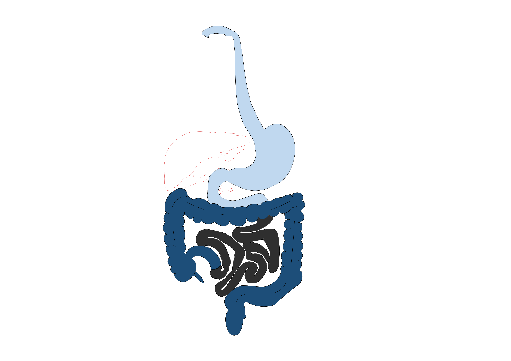
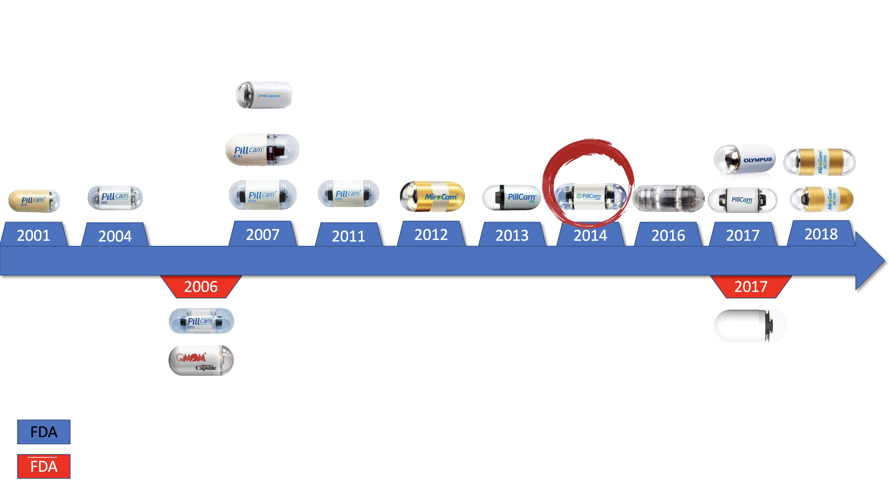

# ¿QUÉ APORTA LA PANCAPSULOENDOSCOPIA EN EL DIAGNÓSTICO DE LA PATOLOGÍA DEL TRACTO DIGESTIVO?
La pancapsuloendoscopia es una técnica novedosa y reciente que se utiliza para el estudio de la patología del tubo digestivo. Cuenta con numerosas ventajas como:
- No requerir sedación
- Capacidad de visualizar todo el tracto gastrointestinal 
- Bajo riesgo de complicaciones

Como se aprecia en la imagen, las técnicas endoscopicas más frecuentes no llegan a cubrir la totalidad del tracto. Dejando al yeyuno y al íleon prácticamente sin posible evaluación a diferencia de las cápsulas de colon.

Sin embargo no están suficientemente estudiadas toda las aplicaciones posibles de esta prueba ni bien definidos los criterios de calidad. Por el hecho de que hasta hace pocos años su uso estaba limitado a la visualización de una única región del tracto digestivo. Pero con la mejoras de la técnologia y la aparición de nuevas casas comerciales se ha empezado a hacer un uso más extenso de la prueba, permitiendose la evaluación completa del tracto gastrointestinal.

Por ello, hemos comparado las diferencias existentes en la cápsula endoscópica a la hora de informar y proceder entre dos centros diferentes. Con este estudio hemos querido hacer una aproximación a cuáles serían los indicadores de calidad para tener una evaluación completa y correcta, mejorando la capacidad diagnóstica de la prueba, independientemente de la indicación. 

Tipo de cápsulas existentes según el año de aprobación por la FDA.

